# ResQMesh

**[🔗 Open Interactive System Blueprint Viewer](resqmesh-blueprint.html)**

> **“When networks fail, people become the network.”**

ResQMesh is an AI-powered offline emergency communication and rescue coordination system designed to keep SOS communication alive during natural disasters, infrastructure collapse, or cellular blackout events.

---

## 🗺️ System Overview & Architecture

When standard telecommunications go dark, ResQMesh establishes a localized peer-to-peer (P2P) wireless network. Emergency signals are automatically routed, cached, triaged, and synchronized to rescue command nodes.

The system lifecycle follows these **9 key steps** (as illustrated in the blueprint above):

1. **Victim Mobile App (SOS Origin)**: Detects cellular blackouts automatically, allowing victims to trigger an SOS. It bundles vital telemetry (GPS coordinates, battery levels, message, timestamp) into an encrypted offline packet.
2. **Offline Mesh Relay Layer**: Packets hop dynamically from device to device (via Bluetooth P2P and Wi-Fi Direct) using a delay-tolerant *Store and Forward* protocol. No internet required.
3. **Gateway Nodes**: Connected hubs (such as Army/ITBP camps, local Police HQ, LoRa/Starlink uplinks, or NGO vehicles) act as sinks, caching and synchronizing incoming SOS payloads to the cloud database the moment they touch network coverage.
4. **Realtime Backend State**: A resilient database structure (Supabase/Firebase with Redis caching) logs incoming alerts, volunteers, gateways, and active mesh nodes.
5. **ASI:ONE Incident AI**: An emergency intelligence model that evaluates raw SOS texts and environmental variables (battery, weather, landslide hazards, terrain) to determine severity classifications, priorities, and match the nearest optimal volunteer.
6. **Command Dashboard**: A unified web console giving dispatch operators consolidated priority alerts, AI dispatch recommendations, and volunteer tracking feeds.
7. **Disaster Map & Layers**: A tactical, layer-controlled operating map of affected regions (e.g., Kedarnath trek route) displaying victim coordinates, hazard boundaries, volunteer pins, and mesh ranges.
8. **Volunteer Rescue Lifecycle**: Chevrons tracking assignments through dispatching, transit, survivor extraction, and safe camp arrival, clearing active incidents from the map upon completion.
9. **Replay Mode & Audit Trail**: Chronological playback player of all incident packet hops, volunteer locations, and alerts for post-incident training and auditing.

---

## 💻 Running the Interactive Blueprint Viewer

We have compiled a browser-based interactive viewer which lets you zoom in on database tables, schema schemas, signal hops, and map layers.

To run it locally:
1. Open the file **`resqmesh-blueprint.html`** in any web browser.
2. Toggle between the **Detailed Blueprint** (full telemetry) and **Simplified Pitch** (slide deck view) versions.
3. Use your **mouse wheel to zoom** and **drag to pan** across the high-resolution canvas.

---

## 🛠️ Main Features
- **Zero Infrastructure SOS**: Connects offline victims to rescuers via local civilian relays.
- **Smart Triage with ASI:ONE**: Translates chaotic texts into prioritized incident cards.
- **Dynamic Simulation Engine**: Simulates cell outages, weather updates, and landslides to train coordinators.
- **Full Audit Timeline**: Records step-by-step P2P packet hopping history.

---

*ResQMesh keeps emergency communication alive when infrastructure fails.*
